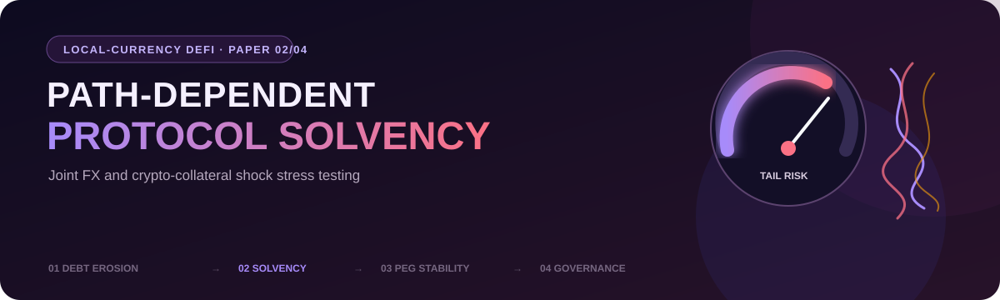
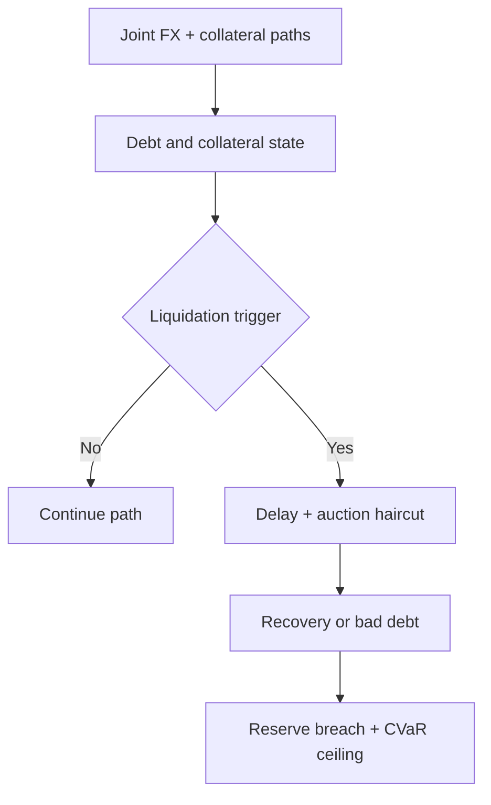

<p align="center">
  
</p>

<h1 align="center">From Debt Erosion to Protocol Solvency</h1>

<p align="center">
  <strong>Path-Dependent Stress Testing of Local-Currency DeFi Lending under Joint FX and Crypto-Collateral Shocks</strong><br>
  Niko Rokni Lamouki · Salma Soofiyan
</p>

<p align="center">
  
  
  
  
</p>

<p align="center">
  <a href="manuscript/main.pdf"><strong>Read the paper</strong></a> ·
  <a href="#reproduce"><strong>Reproduce the analysis</strong></a> ·
  <a href="#research-series"><strong>Explore the series</strong></a>
</p>

---

## At a glance

| Research question | Empirical base | Main contribution |
|---|---|---|
| When does inflation-driven borrower relief become a solvency problem for the lending protocol? | MakerDAO debt-draw calibration, official ARS/TRY FX, and Coin Metrics ETH/BTC returns | A path-dependent engine that joins debt erosion, collateral liquidation, auction congestion, recovery, reserves, and CVaR-based debt ceilings |

> [!IMPORTANT]
> The system is hypothetical. Results are conditional stress-test outputs—not realised borrower returns, forecasts of ARS/TRY or crypto prices, or evidence from a deployed local-currency lending protocol.

## Stress-test architecture



- **Historical calibration:** 130,742 MakerDAO ETH-A debt draws.
- **Market inputs:** official ARS/TRY rates and daily ETH/BTC data resampled to month-end.
- **Realised tests:** 31 rolling 12-month windows from February 2020 to July 2023.
- **Bootstrap tests:** 20,000 paths per currency–collateral pair using 3-month moving blocks.
- **Policy comparison:** static rates versus lagged, FX-responsive rates.
- **Protocol mechanics:** collateral triggers, liquidation delay, auction haircuts, congestion, bad debt, reserves, and CVaR debt ceilings.

## Key findings

| Validation anchor | Result |
|---|---:|
| Monthly return observations | 42 |
| Realised 12-month windows per pair | 31 |
| Bootstrap paths per currency–collateral pair | 20,000 |
| Moving-block length | 3 months |
| Reproducibility seed | `20260810` |
| Adaptive 75% ARS/ETH — mean bad debt, timely liquidation | 3.44% |
| Adaptive 75% TRY/ETH — mean bad debt, timely liquidation | 3.21% |
| ARS/ETH — 99% CVaR, timely liquidation | 30.26% |
| TRY/ETH — 99% CVaR, timely liquidation | 25.75% |

The central result is path dependence: the same average depreciation can lead to materially different solvency outcomes once collateral shocks, liquidation timing, auction capacity, and recovery are allowed to interact.

## Repository map

| Path | Contents |
|---|---|
| [`analysis/`](analysis/) | Stress engine, policies, scenarios, and output generation |
| [`data/`](data/) | Included inputs and processed datasets |
| [`results/`](results/) | Machine-readable stress-test outputs |
| [`tables/`](tables/) · [`figures/`](figures/) | Publication exhibits |
| [`manuscript/`](manuscript/) | LaTeX source and compiled paper |
| [`documentation/`](documentation/) | Data and replication notes |

## Reproduce

The workflow targets **Python 3.11**.

```bash
python -m pip install -r requirements.txt
bash run_all.sh
```

The run regenerates the simulation results, tables, figures, and manuscript outputs. If the original event-level archive is available locally, pass it through the optional raw-data workflow documented in the repository.

## Data provenance

- **MakerDAO:** public on-chain debt-draw activity used for calibration.
- **ARS and TRY:** official OECD exchange-rate series accessed through FRED.
- **ETH and BTC:** Coin Metrics Community market data.

## Research series

| Paper | Focus | Repository |
|---:|---|---|
| 01 | Inflation-driven debt erosion | [inflation-driven-debt-erosion-defi](https://github.com/nikorokni/inflation-driven-debt-erosion-defi) |
| **02** | **Joint FX and collateral shocks → protocol solvency** | **You are here** |
| 03 | Liquidity and arbitrage constraints → peg stability | [local-currency-defi-peg-stability](https://github.com/nikorokni/local-currency-defi-peg-stability) |
| 04 | Oracle latency and automated controls → adaptive governance | [local-currency-defi-adaptive-governance](https://github.com/nikorokni/local-currency-defi-adaptive-governance) |

## Citation

> Rokni Lamouki, N., & Soofiyan, S. (2026). *From Debt Erosion to Protocol Solvency: Path-Dependent Stress Testing of Local-Currency DeFi Lending under Joint FX and Crypto-Collateral Shocks.*

## License

Analysis code and original repository text are released under the MIT License. Third-party data remain subject to their source terms; Coin Metrics Community data are licensed under CC BY-NC 4.0.
